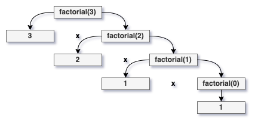

# Final Exam Review

## Table of Contents

- [Final Exam Review](#final-exam-review)
  - [Table of Contents](#table-of-contents)
  - [Exam Information](#exam-information)
- [Exam Topics](#exam-topics)
  - [C++ Syntax](#c-syntax)
  - [Basic Programming Constructs](#basic-programming-constructs)
  - [Code Tracing](#code-tracing)
  - [Classes and Objects](#classes-and-objects)
  - [Constructors / Destructors](#constructors--destructors)
  - [Pointers / Pointer Arithmetic / Memory Tables](#pointers--pointer-arithmetic--memory-tables)
  - [Inheritance](#inheritance)
  - [Encapsulation](#encapsulation)
  - [Recursion](#recursion)
- [Conclusion](#conclusion)

## Exam Information

The final exam will be held in person in your normal classroom on Thurs. May 2 @ 3:00pm-5:00pm.

Your final exam consists of 13-15 questions which make up a total of 110 pts. Just like your previous exams and programming assignments, it will be graded out of 100 pts. You will be expected to answer true/false, multiple choice, code tracing, and code implementation questions. The exam will cover all of the concepts and material that we’ve discussed this semester.

The exam is cumulative, so any topic we’ve discussed is fair game, however, **topics covered after Exam#02 will be weighted more heavily**. There will be *no* backtracking, so don’t spend too much time focusing on that, but you should expect questions and regular recursion.

# Exam Topics

## C++ Syntax

As with any statically-typed programming language, syntax plays a vital role in the composition of C++ programs. That said, it's incredibly difficult to briefly summarize C++ syntax as a whole, so if you need any guidance on this you can find various C++ syntax guides online (Check out this one from [Codecademy](https://www.codecademy.com/learn/c-plus-plus-for-programmers/modules/basic-syntax-in-cpp/cheatsheet)!).

Think you know your stuff? Awesome! See if you can identify the syntax errors in the following examples...

```c++
int main () {
    int test = 0;

    if test == 10 {
        std::cout << "Hello World" << std::endl;
    }
    else {
        std::cout << "foo bar" << std::endl;
    }

    return 0;
}
```

<details><summary>Answer</summary>

The boolean expression for our conditional is not wrapped in parentheses.

</details>

<br>

```c++
int main () {
    int x = 10;
    int y = 15;
     
    std::cout << "x = " << x << ", y = " << y << std::endl

    return 0;
}
```

<details><summary>Answer</summary>

The line containing our 'cout' statement does not end with a semicolon.

</details>

<br>

```c++
#include <iostream>
 
int main () {
    while ("true") {
        std::cout << "Hello!" << std::endl;
    }

    return 0;
}
```

<details><summary>Answer</summary>

The while loop is given a string instead of a boolean expression and cannot evaluate whether or not to continue.

</details>

<br>

## Basic Programming Constructs

**Prove your syntax knowledge - try these from memory!**

**#1** Write a program using a while loop that prints out all even numbers from 1 to 100.

<details><summary>Answer</summary>

```c++
#include <iostream>

int main () {
    int i = 1;

    while (i <= 100) {
        if (i % 2 == 0) {
            std::cout << i << std::endl;
        }
        i++;
    }

    return 0;
}
```

</details>

<br>

**#2** Now try rewriting the previous program using a for loop.

<details><summary>Answer</summary>

```c++
#include <iostream>

int main () {
    for (int i = 1; i <= 100; i++) {
        if (i % 2 == 0) {
            std::cout << i << std::endl;
        }
    }

    return 0;
}
```

</details>

<br>

**#3** Alright, now let's make it a little more challenging. Write a structure named "Course" that holds the following information about a particular course: code/number, name, number of sections, number of students per section, and whether or not that course has labs.

<details><summary>Answer</summary>

```c++
struct Course {
    int code;
    std::string name;
    int sections;
    int sectionMax;
    bool labs;
};
```

</details>

<br>

## Code Tracing

Tracing code is a vital skill as it's essentially the equivalent of reading in computer science. You should be able to read through a program and have a general understanding of what's going on by the end, even if you don't necessarily know the details of how exactly everything happens.

As an example, consider what the resulting values of val1 and val2 might be after running the code snippet below...

```c++
#include <iostream>

void foo (int *ptr, int &q) {
    (*ptr)++;
    ptr = &q;
    (*ptr) *= 4;
}

int main () {
    int val1 = 3;
    int val2 = 7;

    foo(&val1, val2);
    std::cout << val1 << " " << val2 << std::endl;
}
```

<details><summary>Answer</summary>

val1 = 4 and val2 = 28.

</details>

<br>

## Classes and Objects

What are classes and objects?

> In object-oriented programming (OOP), a **class** is an extensible "datatype" for creating **objects** ("variables").
>
> Examples of classes you have already used include ``std::string``, ``std::istream``, and ``std::ostream``.
>
> A class can define **member variables** and behavior (called member functions or methods).
>
> When an object is created, the resulting objects is also called an **instance of the class**.

So, what do classes look like? Here's an example! Pay attention to the comments, they outline the syntax and structure of classes...

**Date.h**

```c++
#include <iostream>

class Date {
    // Private data members; these cannot be accessed outside of the class.
    private:
        int month;
        int day;
        int year;
    
    // Public data members; these may be accessed outside of the class.
    public:
        // Default constructor; takes no parameters and must be public!
        Date ();

        // Parameterized contrusctor; takes paramters and must be public!
        Date (int month, int day, int year);

        // Copy constructor; takes another 'Date' object and must be public!
        Date (Date original);

        // Setter; takes in parameters to indirectly "set" private data.
        void set (int month, int day, int year);

        // Getter; takes in no parameters, returns the date as a string.
        std::string get ();
}; // <-- Remember that class declarations end in semicolons!
```

**Date.cpp**

```c++
#include <iostream>
#include "Date.h"

// Default constructor; notice that the constructor has no type - you're making your own type!
Date::Date () {
    month = 1;
    day = 1;
    year = 2000;
}

// Parameterized constructor; the 'this' keyword can help keep parameters readable.
Date::Date (int month, int day, int year) {
    this->month = month;
    this->day = day;
    this->year = year;
}

// Copy constructor; takes another 'Date' object to set its data members.
Date::Date (Date original) {
    this->month = original.getMonth();
    this->day = original.getDay();
    this->year = original.getYear();
}

// Setter; returns nothing, sets the date to the given parameters.
void Date::set (int month, int day, int year) {
    this->month = month;
    this->day = day;
    this->year = year;
}

// Getter; returns the value of private data 'month'.
int Date::getMonth () {
    return month;
}

// Getter; returns the value of private data 'day'.
int Date::getDay () {
    return day;
}

// Getter; returns the value of private data 'year'.
int Date::getYear () {
    return year;
}

// Simple void function to print the date.
void Date::print () {
    std::cout << month << "/" << day << "/" << year << std::endl;
}
```

**main.cpp**

```c++
#include <iostream>
#include "Date.h"

int main () {
    // Create a new 'Date' object.
    Date may_fourth;

    // Print the current date held by the 'may_fourth' object.
    may_fourth.print();

    // Set the date held by the 'may_fourth' object to May 4, 2023.
    may_fourth.set(5, 4, 2023);

    // Print the current date held by the 'may_fourth' object.
    may_fourth.print();

    return 0;
}
```

The output of the program above is two lines, the first being "1/1/2000" and the second being "5/4/2023".

## Constructors / Destructors

What are constructors and destructors?

> Constructors are special 'methods' used to initialize data memebers when objects are created.
>
> A constructor...
>
> - is a member function (usually ``public``).
> - must have the same name as its class.
> - is automatically called when an object is created.
> - does not have a return type (not even ``void``).
>
> **Constructors CANNOT be called as other methods!**

There are various types of constructors that may be used - take a look at the 'Classes and Objects' section above to see them in action!

## Pointers / Pointer Arithmetic / Memory Tables

What is a pointer?

> A pointer is a special type of variable whose value is the **memory address** of another variable.

Here's a simple example of what that might look like...

```c++
int main () {
    int value = 25;
    int * pointer = &value;

    // We know that the statement below outputs "25"
    std::cout << value << std::endl;

    // What does this statement do?
    std::cout << pointer << std::endl;

    // How about this one?
    std::cout << (*pointer) << std::endl;

    return 0;
}
```

Take a moment to consider the code above. Despite looking very similar, the two print statements after printing our value behave quite differently.

- ``std::cout << pointer << std::endl;`` outputs the **memory address** the pointer is pointing to.
- ``std::cout << (*pointer) << std::endl;`` dereferences the pointer and outputs the **value stored** at that memory address.

What is pointer arithmetic?

> Since pointers hold numerical values representing memory locations, we can actually perform arithmetic on pointers to change what memory address the pointer refers to.
>
> Pointer arithmetic introduces the risk of **null pointers**, which are pointers that contain no valid address to point to.

Here's an example of using pointer arithmetic to simplify recursion...

```c++
void printArray (int * arr, int arr_size) {
    if (arr_size == 0) {
        return;
    }
    std::cout << arr[0];
    printArray(arr + 1; arr_size - 1);
}

int main () {
    int arr = {1, 2, 3, 4, 5};
    int arr_size = sizeof(arr) / sizeof(int);

    printArray(arr, arr_size);

    return 0;
}
```

Notice that in the 'printArray' function, the 'arr_size' variable is utilized as the base case of our recursion and the pointer 'arr' points ahead one memory space per recursive call to get the next item in our array.

## Inheritance

What is inheritance?

> The capability of a class to derive properties and characteristics from another class is called **inheritance**. Inheritance is one of the most important features of Object Oriented Programming.
>
> - **Derived Class**: The class that inherits properties from another class is called Sub Class or Derived Class.
> - **Base Class**: The class whose properties are inherited by sub class is called Base Class or Super class.
>
> The derived class is a *superset* of the base class.
>
> Modes of Inheritance
>
> - **Public Mode**: If we derive a sub class from a public base class then the public members of the base class will become public in the derived class and protected members of the base class will become protected in derived classes.
> - **Protected Mode**: If we derive a sub class from a protected base class then both public and protected members of the base class will become protected in the derived class.
> - **Private Mode**: If we derive a sub class from a private base class then both public and protected members of the base class will become private in the derived class.

Here's an unfinished example of what inheritance might look like...

```c++
class A {
    public:
        int x;

    protected:
        int y;

    private:
        int z;
};

class B : public A {
    // x is public.
    // y is protected.
    // z is not accessible from class B.
};

class C : protected A {
    // x is protected.
    // y is protected.
    // z is not accessible from class C.
};

class D : private A {
    // x is private.
    // y is private.
    // z is not accessible from class D.
};
```

Notice that when classes 'B', 'C', and 'D' derive themselves from class 'A', they all do so in different modes!

## Encapsulation

What is encapsulation?

> Encapsulation is a way to restrict the direct access to some components of an object, so users cannot access state values for all of the variables of a particular object. Encapsulation can be used to hide both data members and data functions or methods associated with an instantiated class or object. [*](https://www.sumologic.com/glossary/encapsulation/)

Take a look back at the [Classes and Objects](#classes-and-objects) section. You'll notice that classes directly implement the idea of encapsulation in their ability to set data as 'private', 'public', etc.

## Recursion

What is recursion?

> Recursion is a problem solving technique in which we solve a task by reducing it to smaller tasks (of the same kind). Then, use the same approach to solve the smaller tasks.
>
> Technically, a recursive function is one that **calls itself**.

Here's a simple recursive function to calculate a factorial...

```c++
int factorial (int n) {
    // Base case
    if (n == 0) {
        return 1;
    }

    // Recursive call
    return factorial(n - 1) * n;
}
```

As you can see, the function above is comprised of a few key factors.

- The **base case** is the condition that must be met for your recursion to stop - it's almost comparable to the condition of a while/for loop.
- The **recursive call** is what actually powers our function, making a call back to the function itself and multiplying its return value by n to get our factorial.

For your exam, you should be comfortable drawing a recursion tree for something like the function above. Here is the recursion tree for that given function.



**REMINDER**: There will be no recursive backtracking on the final exam! 🎉

# Conclusion

You've got this - have a great summer and good luck on your future endeavors!


